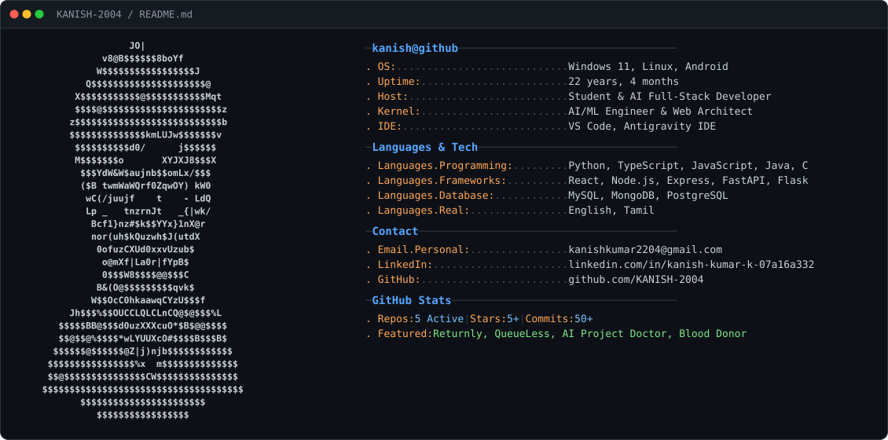

<div align="center">
  <picture>
    <source media="(prefers-color-scheme: dark)" srcset="./dark_mode.svg" />
    <source media="(prefers-color-scheme: light)" srcset="./light_mode.svg" />
    
  </picture>
</div>

<!-- Dynamic Waving Header Banner -->
<div align="center">
  
</div>

<!-- Sliding Typing Intro Animation -->
<div align="center">
  <a href="https://git.io/typing-svg">
    
  </a>
</div>

<br />

<!-- Quick Action & Discipline Badges -->
<div align="center">

[](https://github.com/KANISH-2004)
[](https://github.com/KANISH-2004)
[](https://github.com/KANISH-2004)
[](https://www.google.com/maps)

<br />

<a href="https://github.com/KANISH-2004"></a>
<a href="https://www.linkedin.com/in/kanish-kumar-k-07a16a332/"></a>
<a href="mailto:kanishkumar2204@gmail.com"></a>
<a href="https://github.com/KANISH-2004?tab=repositories"></a>

<br /><br />


&nbsp;

&nbsp;


</div>

---

### 💫 About Me

```yaml
name: Kanish Kumar K
role: AI & Full-Stack Developer
focus: Applied AI, LLMs, Scalable Web Systems & Cloud Architectures
location: India 🇮🇳
passion: Designing intelligent, responsive systems that solve real-world problems
status: Building Agentic AI, Predictive Systems & High-Performance Backends
```

I am a **software engineer and AI-focused product builder** who enjoys turning ambiguous problems into dependable, measurable, and maintainable systems. My work sits at the intersection of backend architecture, full-stack product development, applied machine learning, and developer experience.

I care about more than making software work once. I design for **clarity, observability, security, performance, and long-term ownership**. From shaping an initial product concept to operating production services, I bring a product engineering mindset to every layer of the stack.

- 🔭 **Currently Building:** AI-driven applications with modern full-stack architectures (TypeScript, React, Node.js, Python, Flask & FastAPI).
- 🌱 **Deepening Knowledge In:** Distributed systems, predictive algorithms, retrieval-augmented generation (RAG), and real-time sync systems.
- 💡 **Philosophy:** Great software is fast, intuitive, secure, and delivers measurable real-world value.
- 💬 **Ask me about:** Python, TypeScript, React, System Design, AI/ML integrations, and Database Architecture.

#### Open To

I am open to conversations about **software engineering opportunities, AI engineering, platform engineering, developer tools, open-source collaboration, technical writing, and ambitious product ideas**.

---

### 🛠️ Tech Stack & Tools

<div align="center">
  
</div>

<br />

| Domain | Technologies & Frameworks |
| :--- | :--- |
| **🧠 Languages & Core** | `Python`, `TypeScript`, `JavaScript`, `Java`, `C`, `SQL`, `Bash` |
| **🌐 Frontend & UI** | `React.js`, `HTML5`, `CSS3 / Vanilla CSS`, `Tailwind CSS`, `Responsive Design`, `Figma` |
| **⚙️ Backend & APIs** | `Node.js`, `Express.js`, `FastAPI`, `Flask`, `RESTful APIs`, `JWT Auth`, `WebSockets` |
| **🗄️ Databases & Storage** | `MySQL`, `MongoDB`, `PostgreSQL`, `Redis`, `Cloud Storage` |
| **🤖 AI & Data Science** | `Machine Learning`, `NLP`, `Predictive Modeling`, `Computer Vision`, `LLM Integration`, `RAG` |
| **🛠️ Tools & DevOps** | `Git`, `GitHub`, `GitHub Actions`, `Docker`, `VS Code`, `Postman` |

---

### 🧠 AI / ML Expertise

| Domain | Proficiency | Details |
|:---|:---:|:---|
| **Machine Learning** | Advanced | Supervised learning, predictive modeling, feature engineering, and inference pipelines. |
| **Deep Learning** | Advanced | Neural architectures, representation learning, and custom model fine-tuning. |
| **Natural Language Processing** | Advanced | Semantic search, text classification, embeddings, information extraction, and intent parsing. |
| **Generative AI & LLMs** | Advanced | LLM application workflows, prompt engineering, structured outputs, and autonomous agent loops. |
| **Retrieval-Augmented Generation** | Advanced | Document ingestion, vector search, chunking, reranking, and citation-grounded generation. |
| **Computer Vision** | Intermediate | Image classification, multimodal visual similarity matching, and visual data verification. |
| **Responsible AI & Security** | Intermediate | Privacy-preserving workflows, input validation, output safety guardrails, and auditability. |

---

### 🚀 Featured Projects & Repositories

<table>
  <tr>
    <td width="50%" valign="top">
      <h3 align="center">🔍 <a href="https://github.com/KANISH-2004/FIND-LOST-PRODUCTS">Returnly (Lost & Found AI)</a></h3>
      <p align="center">
        
        
      </p>
      <p>An intelligent lost-and-found ecosystem featuring <strong>AI-assisted photo matching</strong>, verified claims verification, location tags, secure item recovery workflows, and automated moderation.</p>
      <ul>
        <li>🛡️ Private claim verification & contact masking</li>
        <li>🤖 Multimodal visual & keyword item similarity</li>
        <li>⚡ Real-time status tracker & search filters</li>
      </ul>
      <p align="center">
        <a href="https://github.com/KANISH-2004/FIND-LOST-PRODUCTS"><strong>Explore Repo →</strong></a>
      </p>
    </td>
    <td width="50%" valign="top">
      <h3 align="center">⏱️ <a href="https://github.com/KANISH-2004/QUEUELESS">QueueLess</a></h3>
      <p align="center">
        
        
      </p>
      <p>Smart predictive queue management eliminating physical waiting lines through <strong>virtual tokens</strong>, dynamic wait-time estimation, and no-show risk prediction.</p>
      <ul>
        <li>🎫 QR-based virtual queue ticketing</li>
        <li>📈 Machine learning wait-time forecasting</li>
        <li>📊 Live staff dispatch and analytical dashboard</li>
      </ul>
      <p align="center">
        <a href="https://github.com/KANISH-2004/QUEUELESS"><strong>Explore Repo →</strong></a>
      </p>
    </td>
  </tr>
  <tr>
    <td width="50%" valign="top">
      <h3 align="center">🩺 <a href="https://github.com/KANISH-2004/AI-PROJECT-DOCTOR">AI Project Doctor</a></h3>
      <p align="center">
        
        
      </p>
      <p>An automated AI diagnostics SaaS analyzing software projects to generate <strong>evidence-based health audits</strong>, security vulnerability checks, dependency inspections, and prioritized refactoring roadmaps.</p>
      <ul>
        <li>🩺 Comprehensive code health scoring</li>
        <li>🔒 Security & dependency vulnerability scanners</li>
        <li>🗺️ Step-by-step developer remediation path</li>
      </ul>
      <p align="center">
        <a href="https://github.com/KANISH-2004/AI-PROJECT-DOCTOR"><strong>Explore Repo →</strong></a>
      </p>
    </td>
    <td width="50%" valign="top">
      <h3 align="center">🩸 <a href="https://github.com/KANISH-2004/blood-donor">Blood Donor Portal</a></h3>
      <p align="center">
        
        
      </p>
      <p>A mission-critical blood donation network connecting donors with hospitals and patients in emergencies, streamlining urgent blood group matching and availability.</p>
      <ul>
        <li>🩸 Emergency blood group directory & fast filter</li>
        <li>📍 Location-based donor matching</li>
        <li>🔔 Instant donor alert dispatch</li>
      </ul>
      <p align="center">
        <a href="https://github.com/KANISH-2004/blood-donor"><strong>Explore Repo →</strong></a>
      </p>
    </td>
  </tr>
  <tr>
    <td width="50%" valign="top">
      <h3 align="center">💼 <a href="https://github.com/KANISH-2004/EMPLOYEE-SALARY-PREDICTION">Employee Salary Prediction</a></h3>
      <p align="center">
        
        
      </p>
      <p>An interactive ML application accurately predicting annual employee compensation with <strong>Linear Regression</strong> based on experience, education, and job roles.</p>
      <ul>
        <li>🔮 Real-time salary estimation & interactive inputs</li>
        <li>📊 Comprehensive evaluation metrics (R², MAE, RMSE)</li>
        <li>📈 Exploratory data analysis & statistical distributions</li>
      </ul>
      <p align="center">
        <a href="https://github.com/KANISH-2004/EMPLOYEE-SALARY-PREDICTION"><strong>Explore Repo →</strong></a>
      </p>
    </td>
    <td width="50%" valign="top">
      <h3 align="center">🤖 <a href="https://github.com/KANISH-2004/college-Chatbot-AI">AI College Enquiry Chatbot</a></h3>
      <p align="center">
        
        
      </p>
      <p>Intelligent NLP chatbot assisting students 24/7 with instant information regarding admissions, curriculums, examinations, schedules, fees, and campus services.</p>
      <ul>
        <li>🎓 24/7 automated campus & admission inquiries</li>
        <li>💬 Natural language intent classification & response</li>
        <li>⚡ Quick query resolution for academic schedules</li>
      </ul>
      <p align="center">
        <a href="https://github.com/KANISH-2004/college-Chatbot-AI"><strong>Explore Repo →</strong></a>
      </p>
    </td>
  </tr>
  <tr>
    <td colspan="2" align="center">
      <p>
        <a href="https://github.com/KANISH-2004?tab=repositories"><strong>Browse All Active Repositories →</strong></a>
      </p>
    </td>
  </tr>
</table>

---

### 💼 Engineering Experience & Leadership

#### AI & Full-Stack Engineer · Product Development
**Present**
- Architect and develop end-to-end intelligent web platforms utilizing React, Node.js, Python, and modern AI APIs.
- Design resilient REST APIs, schema definitions, and authentication boundaries.
- Build predictive algorithms and automated analytical workflows with real-time UI synchronization.
- Implement proactive code health, automated testing, and developer tooling.

#### Open Source & Developer Community
**Ongoing**
- Build focused, open-source solutions addressing developer productivity, health audits, and community aid.
- Explore agentic AI patterns, retrieval workflows, and high-performance full-stack architectures.

---

### 🏆 Achievements & Key Milestones

<div align="center">

| Area | Milestone / Impact |
|:---:|:---|
| 🚀 **Product Delivery** | Shipped full-stack AI applications including Returnly, QueueLess, AI Project Doctor, and Employee Salary Prediction. |
| 🧠 **AI Innovation** | Implemented multimodal matching, predictive wait-time forecasting, and automated code health auditing. |
| 🌐 **Open Source** | Actively publishing maintainable, modular software repositories for the developer community. |
| ⚡ **System Design** | Focused on creating clean architecture, resilient data pipelines, and responsive interfaces. |

</div>

---

### 📜 Certifications & Verified Credentials

<div align="center">

[](https://www.credly.com/badges/61bf0c16-85b1-46f6-be67-1ea30c7abf86)
[](https://www.credly.com/badges/95874c30-b14d-4d7f-a681-308ff83380da)
[](https://www.credly.com/badges/b78d854f-33f9-4728-bddb-58e2b1ac598f)
[](https://www.credly.com/badges/b57c6cfd-9a6d-4320-b760-3391136999ce)
<br />
[](https://www.skills.google/public_profiles/54100f4d-906e-449f-9667-adedf1d8795d/badges/27371734)
[](https://www.skills.google/public_profiles/54100f4d-906e-449f-9667-adedf1d8795d/badges/27372301)
[](https://www.skills.google/public_profiles/54100f4d-906e-449f-9667-adedf1d8795d/badges/27372830)

<br /><br />

| Certificate / Credential | Domain | Issuer | Credential Verification |
| :--- | :--- | :---: | :---: |
| **Building AI Agents with MongoDB** | Agentic AI & Systems | MongoDB | [Verify on Credly ↗](https://www.credly.com/badges/61bf0c16-85b1-46f6-be67-1ea30c7abf86) |
| **Building RAG Apps Using MongoDB** | Retrieval-Augmented Generation | MongoDB | [Verify on Credly ↗](https://www.credly.com/badges/95874c30-b14d-4d7f-a681-308ff83380da) |
| **AI-Powered Search with MongoDB Vector Search** | Embeddings & Vector Search | MongoDB | [Verify on Credly ↗](https://www.credly.com/badges/b78d854f-33f9-4728-bddb-58e2b1ac598f) |
| **MongoDB Basics for Students** | Document Database & CRUD | MongoDB | [Verify on Credly ↗](https://www.credly.com/badges/b57c6cfd-9a6d-4320-b760-3391136999ce) |
| **Introduction to Generative AI** | Generative AI Concepts | Google Cloud | [Verify on Google Skills ↗](https://www.skills.google/public_profiles/54100f4d-906e-449f-9667-adedf1d8795d/badges/27371734) |
| **Introduction to Large Language Models** | Large Language Models (LLMs) | Google Cloud | [Verify on Google Skills ↗](https://www.skills.google/public_profiles/54100f4d-906e-449f-9667-adedf1d8795d/badges/27372301) |
| **Build a Certification Study Guide: PMLE** | ML Engineer Study Guide | Google Cloud | [Verify on Google Skills ↗](https://www.skills.google/public_profiles/54100f4d-906e-449f-9667-adedf1d8795d/badges/27372830) |

</div>

---

### 💻 Competitive Coding & Problem Solving

<div align="center">

<a href="https://leetcode.com/u/kanishkumar/" target="_blank">
  
</a>
<a href="https://auth.geeksforgeeks.org/user/KANISH-2004/">
  
</a>
<a href="https://www.hackerrank.com/profile/kanishkumar2204" target="_blank">
  
</a>
<a href="https://www.codechef.com/users/KANISH-2004">
  
</a>

<br /><br />

<a href="https://leetcode.com/u/kanishkumar/" target="_blank">
  
</a>

</div>

---

### 📊 GitHub Analytics & Overview

<div align="center">

<a href="https://github.com/KANISH-2004">
  
</a>
<a href="https://github.com/KANISH-2004">
  
</a>

<br /><br />


</div>

---

### 📈 Contribution Activity

<div align="center">


</div>

---

### 🐍 Contribution Snake

<div align="center">

<picture>
  <source media="(prefers-color-scheme: dark)" srcset="https://raw.githubusercontent.com/KANISH-2004/KANISH-2004/output/github-contribution-grid-snake-dark.svg" />
  <source media="(prefers-color-scheme: light)" srcset="https://raw.githubusercontent.com/KANISH-2004/KANISH-2004/output/github-contribution-grid-snake.svg" />
  
</picture>

</div>

---

### 🎯 Current Focus

```yaml
learning:
  - Distributed systems and resilient event-driven architecture
  - Advanced LLM evaluation and retrieval-augmented generation
  - High-performance predictive models and caching layers

building:
  - Agentic AI productivity and diagnostic software
  - Reliable full-stack products with clean interfaces
  - Open-source tools for engineering teams

exploring:
  - Autonomous AI workflows with human-in-the-loop controls
  - Privacy-preserving machine learning applications
  - Real-time collaborative web interfaces

open_to:
  - Full-stack & AI engineering opportunities
  - Platform & developer productivity collaboration
  - Open-source projects and technical conversations
```

---

### 📬 Connect & Collaborate

<div align="center">

<a href="https://www.linkedin.com/in/kanish-kumar-k-07a16a332/" target="_blank">
  
</a>
&nbsp;
<a href="mailto:kanishkumar2204@gmail.com" target="_blank">
  
</a>
&nbsp;
<a href="https://github.com/KANISH-2004" target="_blank">
  
</a>
&nbsp;
<a href="https://github.com/KANISH-2004?tab=repositories" target="_blank">
  
</a>

</div>

<br />

<div align="center">

> Build with intent. Ship with discipline. Learn without limits.


</div>